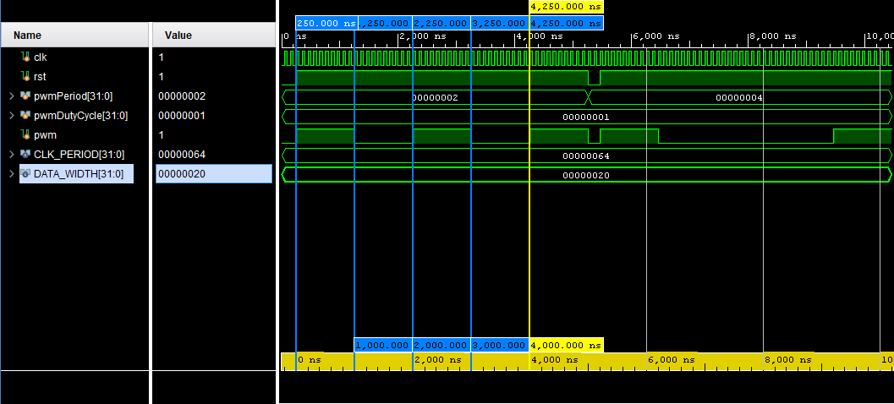
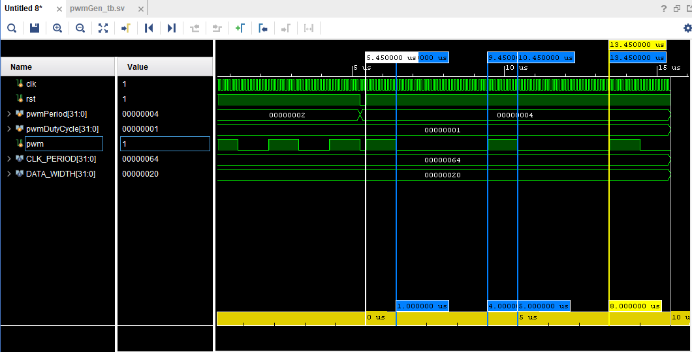
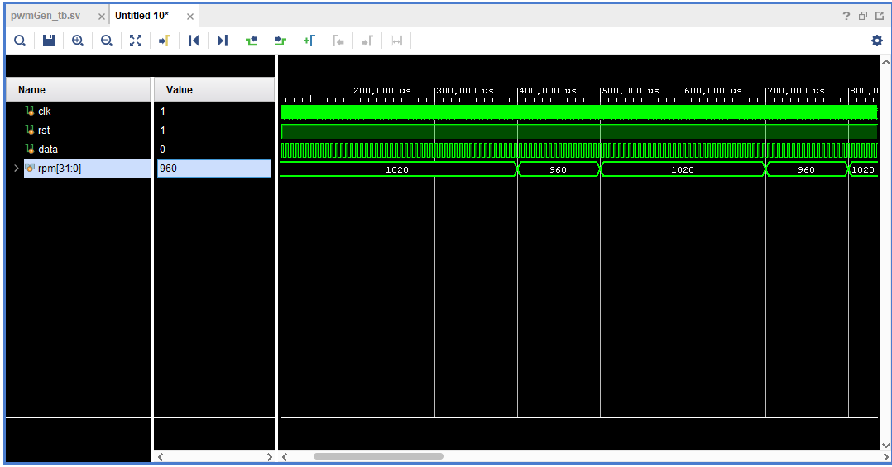

# FPGA-Engineer-Assignment-Aevocode

Top Schemetic of module 1:

1) AXI slave module implemented and testbench added

2) PWM generator implemented and testbench added
 first set of values are pwmperiod = 2 and pwmsutycycle = 1
 
 second set of values    pwmperiod = 4 and pwmsutycycle = 1
 

3) motor rpm counter
 encoder signal set to 1000 rpm
 
 final result innaccurate due to frequency based measurement approach

